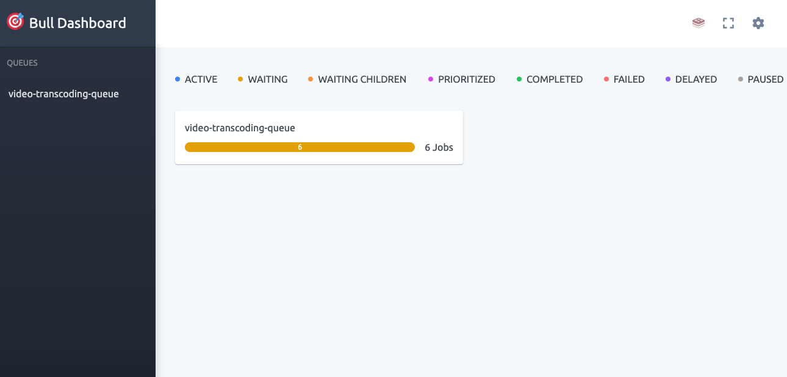

### Introduction

This module provides a web-based UI for monitoring and managing BullMQ queues used in the Redis Event Hub platform. It helps to visualize jobs, queues, and their statuses in real time.

### Key Features

- View all BullMQ queues and their job statuses (active, completed, failed, delayed, etc.)
- Inspect job details and payloads
- Pause, resume, or clean queues
- Real-time updates

### Pre-requisites for local set up

- Node.js and npm installed
- `.env` file with necessary environment variables (e.g., `PORT`, `REDIS_URL`)
- Redis instance (local): docker image on local. I am using docker desktop. 

### Getting Started on local
1. Open terminal and go to the `redis-bullboard-monitor` directory

2. Install dependencies:
   ```
   npm install
   ```
3. Run `npx tsc --watch` in the terminal to convert .ts files to .js

4. Open another terminal and go to the `redis-bullboard-monitor` directory and start server
    ```
    npm start
    ```

5. Open the bull board monitor by accessing the link - `http://localhost:3000/admin/queues`

6. You should see jobs waiting in the **video-transcoding-queue**. Refer below screenshot


7. You see the jobs waiting in queue as there is no worker available to process. Lets start the worker now.
   Lets go to the [README.md](../redis-event-consumer/README.md) file of `redis-event-consumer` project.


### Notes
- Ensure that the Redis connection details match those used by your BullMQ producers and consumers.
- For production deployments, secure the BullBoard UI with authentication and HTTPS as needed.