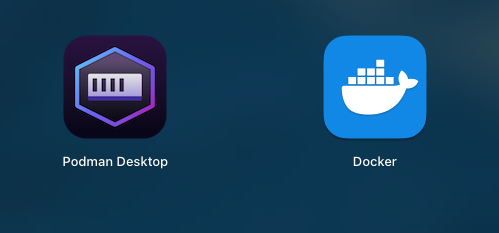
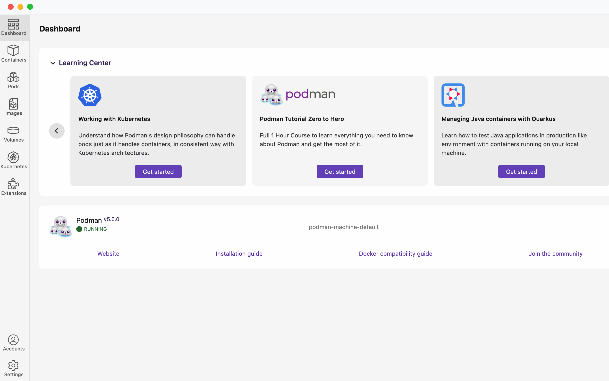
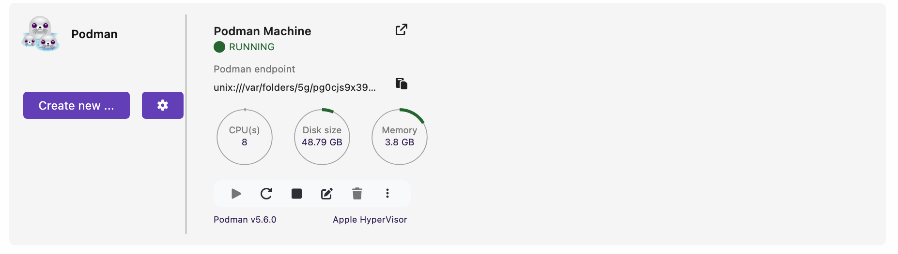
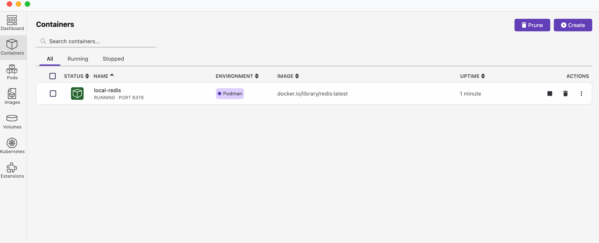

### Introduction

The **Redis Event Gateway** is a Node.js-based microservice designed to handle event-driven workflows using Redis as a message broker. This service provides an HTTP API to enqueue events, such as video processing jobs, into a Redis-backed queue for asynchronous processing.

### Key Features
- **Event Queue Management**: Handles event queuing for tasks like video transcoding.
- **Redis Integration**: Utilizes Redis for efficient message brokering and stream processing.
- **REST API**: Provides a simple HTTP interface for interacting with the service.
- **TypeScript Support**: Ensures type safety and better developer experience.
- **Cloud-Ready**: Configured for deployment on SAP BTP with support for managed Redis services.

### Use Case
This service is ideal for scenarios where asynchronous processing of tasks is required, such as:
- Video transcoding
- Asynchronous feed generation
- Data processing pipelines

### Docker Desktop Setup
- Follow the below steps to install Docker on your machine - https://docs.docker.com/desktop/setup/install/mac-install/

### Prerequisites for local setup
- Node.js and npm installed
- Pull and run redis image in docker using the below command. 
```
docker run --name local-redis -p 6379:6379 -d redis
```
- Start redis container
- `.env` file with necessary environment variables (e.g., `PORT`, `REDIS_URL`)

### Getting Started on local
1. Open terminal and go to the `redis-event-gateway` directory

2. Install dependencies:
   ```
   npm install
   ```
3. Run `npx tsc --watch` in the terminal to convert .ts files to .js

4. Open another terminal and go to the `redis-event-gateway` directory and start server
    ```
    npm start
    ```

5. Follow the README.md of the below projects before moving ahead
    - [redis-event-consumer](../redis-event-consumer/README.md)
    - [redis-bullboard-monitor](../redis-bullboard-monitor/README.md)

6. Test the API using the provided [requests.http](requests.http) file or any HTTP client like Postman.

7. Execute the requests sequentially. If you see below error message
    ```JSON
    {
        "error": "EDA is not enabled. Please enable the feature flag to use this endpoint."
    }
    ```
   You have to toggle this flag to `true` using the request provided in [requests.http](requests.http)
   and then execute `http://localhost:8080/transcode/video`
8. You should see the below log in the console logs
    ```JSON
    Message added to video-transcoding-queue, PAYLOAD: {
        "videoId": "12345-11",
        "title": "Sample Video",
        "description": "This is a sample video for testing purposes.",
        "s3Location": "s3://my-bucket/videos/12345.mp4",
        "transcodingTypes": [
          "1080p",
          "720p",
          "480p"
        ],
        "format": "mp4",
        "resolution": "1080p",
        "duration": 120,
        "uploadedBy": "user123",
        "uploadDate": "2025-07-03T10:00:00Z"
    }
    ```

### Podman Setup
1. Install Podman

```
brew install --cask podman-desktop
```

2. Post successful installation, you will see the Podman application



3. Once step 2 is done, The podman desktop will ask to complete 
    a. Podman Setup (mandatory)
    b. Kubectl Setup (optional)
    c. Componse Setup (optional)

    I am skipping the Kubectl Set up for now as I do not intend to use it right away.

4. YOu will see a nice GUI as shown below



5. Set up the podman machine as per your preferred settings. I have done some basic settings as shown in the below screenshot.



5. Some common podman cli commands

```
podman machine list
```

```
podman machine inspect
```

```
podman machine stop
```

```
podman machine start
```

6. Run the below command to pull the redis  image in podman desktop and start the container
```
podman run --name local-redis -p 6379:6379 -d redis
```

7. You will see the container as shown in the below screenshot



8. Start all your local servers by following the section `Getting Started on local`

9. Execute the requests in the requests.http. 
    The application should work as it was working with Docker without any change in the application configuration or code